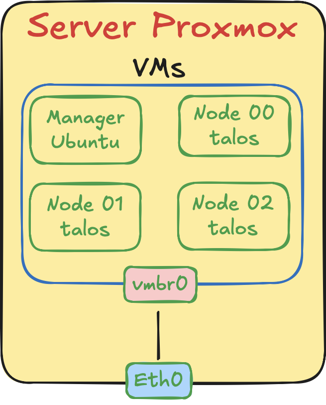

## First issue
### Multiples environnements 
First, I need to connect to my server in SSH and in http to manage Proxmox. 

With this diagram you can see a simple usage of VM machine. But, I have personal conditions.  
I need to have a virtual network to have a stable IP of my node in my cluster. But, as you can see, in default with proxmox, you have one bridge created connect to the physical Ethernet port in the server. And, I change environnement to work in my office, and my home because I don't have an internet box in there, so for connect my server to my PC, I need to connect the Ethernet ports of the server and my PC in direct.  

But, without DHCP server I can't have an IP in my server. I lost 2 hours to find a solution. I force the PC to share wifi connection to the Ethernet port. With this solution, the network DHCP works well with the network `192.168.137.xx`. By default the PC is `.1` and the server is `.2`.

With this solution, I can connect to my server. 

### Virtual brige for the cluster
To prevent a change of the VM during changement of environnement, the solution is to build a virtual brige specific to the cluster. It's prety easy to create.  
I create a vmb1 brige, and I add this brige to all my cluster node and my manager node. I just add new network interface. And, it dosen't works. Want a virtual network is create, it's empty. When you connect all your machine in there, it's like having 4 machines in the same network, but nobody can interact because none have IP aadress. After understand this (it took me 2 houres), I needed install DHCP server on my Proxmox server, and administrate the vmb1 brige to allocate IP adresse automaticaly.

#### Install DHCP server
This part was prety easy, you just need to choose a DHCP server, and install it. I choose `dnsmasq`for this lighweht.

#### Configure DHCP
I need to configure  the first and 